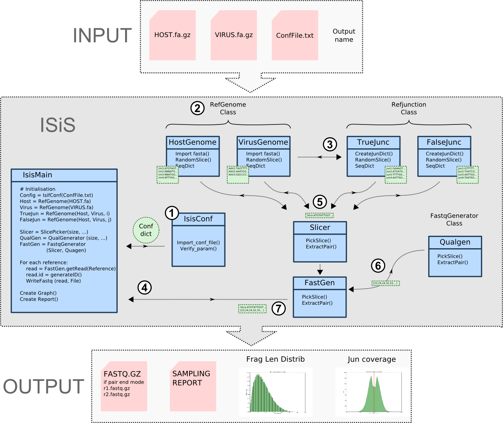

# Isis (Insertion Site Sampler)

## Motivation

ISIS generates random insertion sites of a given viral DNA in an host DNA and output Fastq Files

## Principle



## Get Isis

### From github repository 
``` bash
$ git clone https://github.com/a-slide/Isis my_folder/
```

### Archive download
* [ZIP archive](https://github.com/a-slide/Isis/archive/master.zip)
* [TAR.GZ archive](https://github.com/a-slide/Isis/tarball/master)

The program must be made executable using *chmod*.
``` bash
$ sudo chmod u+x Isis.py
```

## Usage

``` bash
Usage: IsisMain.py -H Host_genome.fa[.gz] -V Viral_genome.fa[.gz] -C Conf_file.txt [-o Output_prefix] [-p |-s]

Options:
  --version             show program's version number and exit
  -h, --help            show this help message and exit
  -H, --host_genome     Path of the fasta file containing the host genome sequence (can be gziped)
  -V, --virus_genome    Path of the fasta file containing the viral genome sequence (can be gziped)
  -C, --conf_file       Path of the configuration text file
  -o, --output          Facultative option to indicate the name of the output prefix (default = out)
  -s, --single          Facultative option to indicate the name of the output prefix
  -p, --pair            Pair end mode incompatible with -s option (default mode)
```

### Configuration file
conf.txt

### Reference genome fasta files

Viral_genome.fasta
Host_genome.fast

### Dependencies:

The programm was developed under Linux Mint 16 "petra" but is compatible with other LINUX debian based distributions.
* python 2.7 +
* Biopython

## Dev Notebook (french)

* [Notebook](http://nbviewer.ipython.org/github/a-slide/Isis/blob/master/doc/Logbook.ipynb)

## Authors and Contact

Adrien Leger - 2014
* <adrien.leger@gmail.com>
* <adrien.leger@inserm.fr>
* <adrien.leger@univ-nantes.fr>
* [Github](https://github.com/a-slide)
* [Atlantic Gene Therapies - INSERM 1089] (http://www.atlantic-gene-therapies.fr/)

